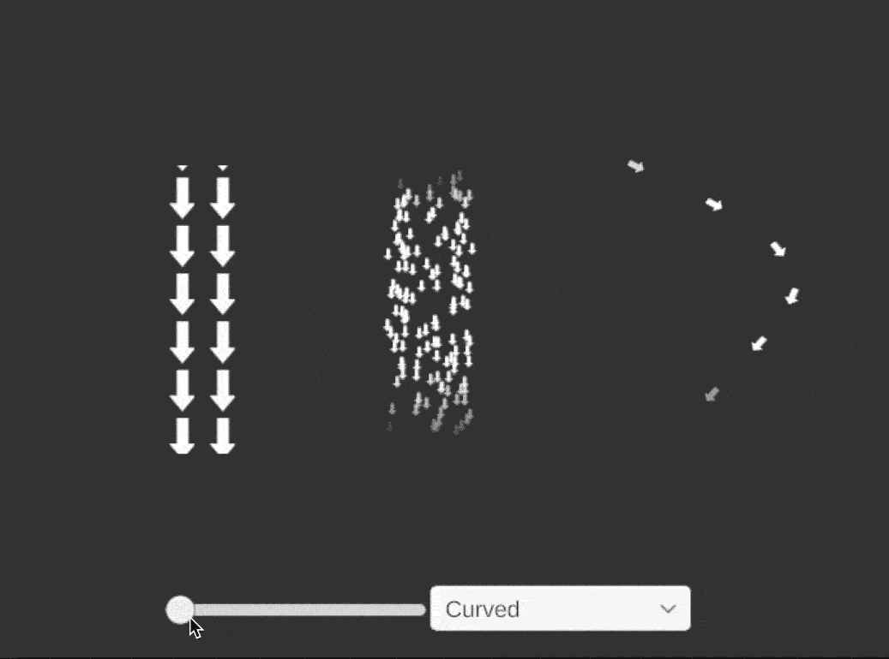

# FlowTest
 
 
 
 
 Test project for indicating flows using a UV animated shader (created with ShaderGraph) and a VFXGraph.  The VFX Graph's require the VFXGraph Package and the Package Samples.
 
 To use the MeshToTriangles example, you need to first generate the gameobjects by running the game. Then, copy/paste the objects that were created from the 'Normal' mesh back into your scene. This is required because I was not able to assign the Targets at runtime in the Multiple Position Binder. Fixes to that problem would be appreciated!
